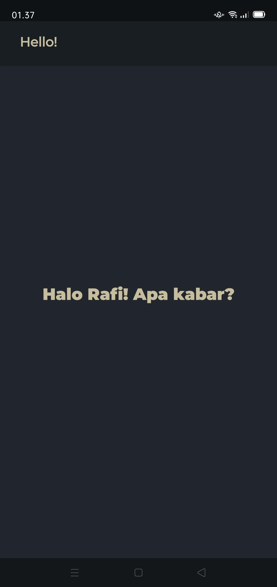
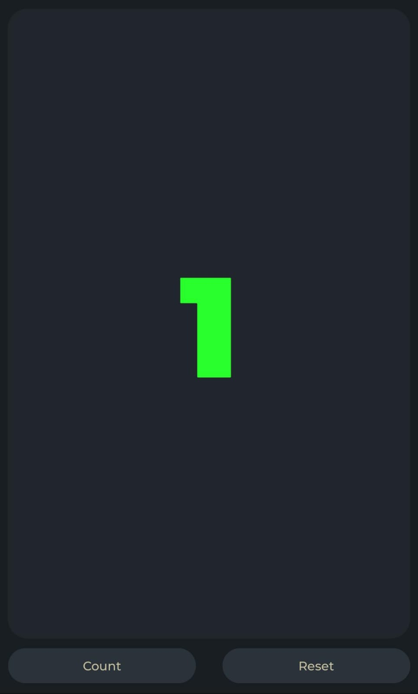
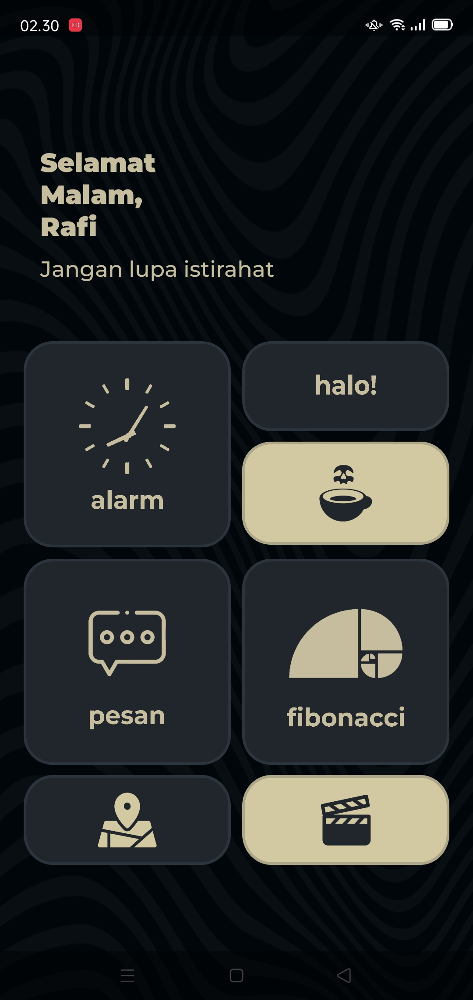

```
Mata Kuliah : Pemrograman Mobile 1
Dosen       : Donny Maulana, S.Kom., M.M.S.I.
Nama        : Rafi Maulana Firdaus
NIM         : 312210382
```
--------------------------


Hyperlink masing-masing penjelasan lengkap setiap activity :  

- [Penjelasan Hello](Read/READMEHello.md)
- [Penjelasan Toast](Read/READMEToast.md)
- [Penjelasan News/ScrollingIceCold](Read/READMENews.md)
- [Penjelasan Pesan (Activity1&2)](Read/READMEPesan.md)
- [Penjelasan Fibonacci](Read/READMEFibonacci.md)
- [Penjelasan Alarm](Read/READMEAlarm.md)
- [Penjelasan Maps](Read/READMEMaps.md)
- [Penjelasan Splash](Read/READMESplash.md)
- [Penjelasan Fragment](Read/READMEFragment.md)
- [Penjelasan Sinopsis & Trailer](Read/READMETrailer.md)

---------------------------

## 1. Halo
Activity pertama yang dibuat adalah Activity Halo. Menampilkan aktivitas teks "Halo! Apa Kabar?"  
  
  

## 2. Toast
Pesan pop-up sederhana yang muncul di layar, memberi tahu user status tertentu. Toast biasanya digunakan untuk memberikan umpan balik singkat.

```JAVA
public void showToast(View view) {
        Toast toast = Toast.makeText(this, R.string.toast_message, Toast.LENGTH_SHORT);
        toast.show();
    }
```

```JAVA
<string name="toast_message">Hello Toast!</string>
```

## 3. Scrolling (Ice Cold)
Menampilkan teks berita yang dapat di scroll. Menggunakan metode `scrollview` yang didalamnya diisi dengan `textview` berita.

```JAVA
<ScrollView
        android:layout_width="wrap_content"
        android:layout_height="wrap_content">
       <TextView ... />
</ScrollView>
```

## 4. Count
  

## 5. Fibonacci  
https://github.com/RafiMlnf/AndroidStudio-1/assets/115614668/c59279ce-d453-40ec-9b4e-708296b6d60a

## 6. Intent  
Implicit Intent - aktivitas yang diinginkan meminta sistem untuk membuka kamera, alarm, maps, dll.  
Explicit Intent - berpindah dari satu aktivitas ke aktivitas lainnya di dalam aplikasi Android Anda.  

> Contoh: Explicit intent dari aktivitas 1 ke aktivitas 2

https://github.com/RafiMlnf/AndroidStudio-1/assets/115614668/049a9ea9-220e-44fa-9f53-7501f1525a4c

## 7. Pesan  
Mengirimkan pesan dari aktivitas 1 lalu menampilkan pesan di aktivitas 2 (Explicit intent)  

https://github.com/RafiMlnf/AndroidStudio-1/assets/115614668/aaf0a9d5-d487-4874-adcf-7bc2b53a68b8

## 8. Menu
Tata letak untuk setiap aktivitas  

  

## 9. Maps  
Memanggil/meminta sistem untuk membuka Google Maps (Implicit intent)  

https://github.com/RafiMlnf/AndroidStudio-1/assets/115614668/fd2907a0-4c93-436e-9812-d763dee6c075

## 10. Splash  
Layar awal yang muncul sebentar saat aplikasi dijalankan sebelum berpindah ke layar utama atau menu utama.

https://github.com/RafiMlnf/AndroidStudio-1/assets/115614668/d1b48d1e-c2e9-419f-be3e-ca7e7252c546

## 11. Fragment
Fragments dalam Android Studio adalah komponen UI yang dapat digunakan untuk membangun antarmuka pengguna yang dapat diulang dan modular. Fragments memungkinkan untuk membuat tata letak yang dinamis dan fleksibel, terutama untuk aplikasi yang dapat dijalankan di perangkat dengan layar yang berbeda-beda, seperti tablet dan ponsel.

## 12. Sinopsis & Trailer / Playable Video  
https://github.com/RafiMlnf/AndroidStudio-1/assets/115614668/fbe6aa79-1ada-4924-8ba4-ccecd21963d7

----------------------------

## Fitur diluar Tugas
### 1. Splash
   - Transisi fade in ketika aplikasi dibuka
   - Penggunaan interpolator exponential out pada splash art
     
     > Ada banyak jenis interpolator, seperti ease in/out, bounce in/out, sine in/out, back in/out, linear in/out, dan masih banyak lagi.
   - Transisi fade out dari splash ke menu

### 2. Menu
   - Teks salam pada menu, menyesuaikan jam Waktu Indonesia Barat
   - Random teks, akan berganti-ganti ketika aplikasi dibuka
   - Animasi pressed respons / responsive icon ketika ditekan

### 3. Fragment
   - Animasi pressed respons / responsive icon ketika ditekan

## Capture akhir dari semua aktivitas :  

https://github.com/RafiMlnf/AndroidStudio-1/assets/115614668/d83bcbc4-abc4-4cab-abd0-84f6a7266ba2

--------------------------
# Terima Kasih

