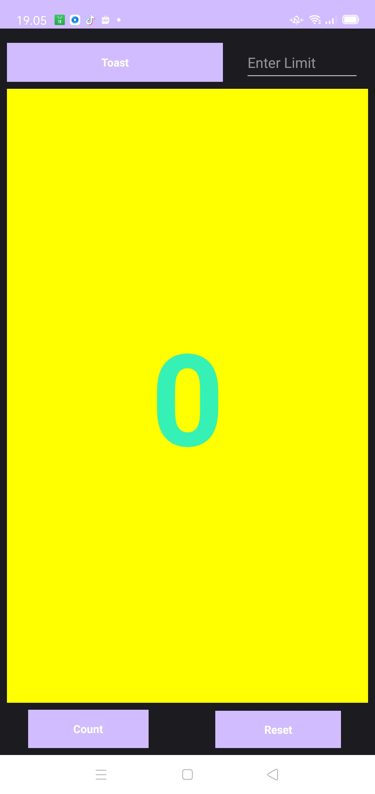
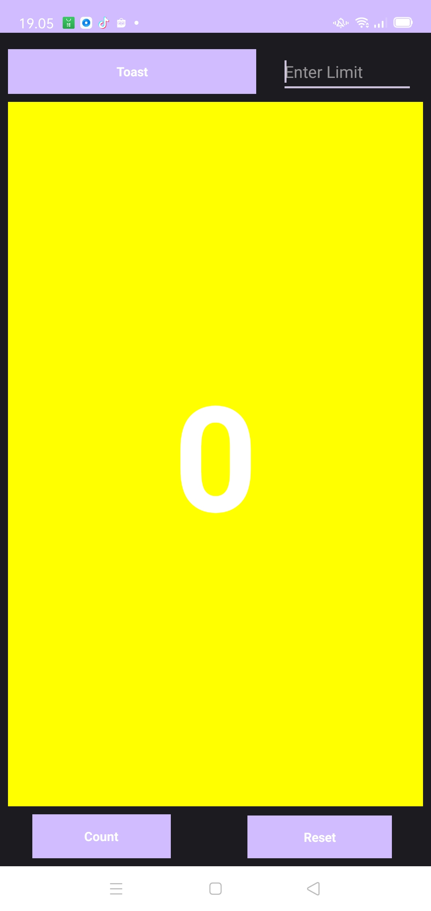
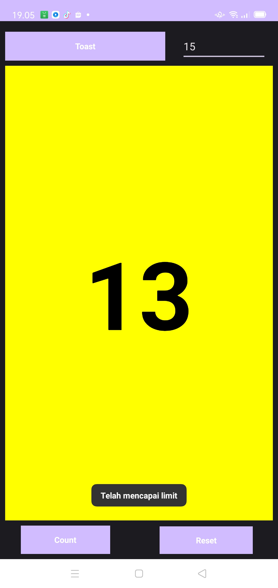

## Fibonacci  





---

## Penjelasan
## 1. Metode countUp(View view)

```JAVA
public void countUp(View view) {
    EditText inputLimit = findViewById(R.id.input_limit);
    if(!inputLimit.getText().toString().isEmpty()) {
        int limit = Integer.parseInt(inputLimit.getText().toString());
        if(mCount >= limit) {
            Toast.makeText(this, "Telah mencapai limit", Toast.LENGTH_LONG).show();
            return;
        }
    }
    int next = mCount;
    mCount = secondCount;
    secondCount = next + mCount;
    if (mShowCount != null)
        mShowCount.setTextColor(setColor());
    mShowCount.setText(Integer.toString(next));
}
```

Metode ini terfokus pada perhitungan deret Fibonacci dan pembaruan tampilan pada suatu aplikasi. Pertama, nilai batas diambil dari komponen EditText dengan ID "input_limit". Proses ini melibatkan pengecekan apakah nilai batas tidak kosong. Jika tidak kosong, nilai tersebut dikonversi ke tipe data int. Selanjutnya, dilakukan pengecekan apakah nilai saat ini (mCount) lebih besar atau sama dengan batas yang telah ditetapkan. Jika kondisi ini terpenuhi, metode akan menampilkan pesan Toast dan menghentikan eksekusi lebih lanjut.

Jika batas tidak tercapai, metode akan melanjutkan dengan melakukan perhitungan deret Fibonacci dan mengupdate tampilan aplikasi sesuai dengan nilai yang dihitung. Selain itu, metode ini juga mengatur warna teks pada tampilan menggunakan metode setColor(). Dengan pendekatan ini, aplikasi dapat memberikan respons yang sesuai terhadap input pengguna dan memastikan bahwa perhitungan deret Fibonacci dan pembaruan tampilan berjalan dengan tepat.

### Poin-poin:

- Metode ini terkait dengan penanganan perhitungan deret Fibonacci dan pembaruan tampilan.
- Mengambil nilai batas dari EditText dengan ID input_limit.
- Jika batas tidak kosong, maka konversi nilai tersebut ke tipe data int.
- Jika nilai saat ini (mCount) lebih besar atau sama dengan batas, tampilkan pesan Toast dan hentikan eksekusi metode.
- Selanjutnya, lakukan perhitungan deret Fibonacci dan perbarui tampilan sesuai dengan nilai yang dihitung.
- Set juga warna teks pada tampilan menggunakan metode setColor().

## 2. Metode reset(View view)

```JAVA
public void reset(View view) {
    mCount = 0;
    secondCount = 1;
    if (mShowCount != null)
        mShowCount.setText(Integer.toString(mCount));
}
```

### Penjelasan

Metode ini digunakan untuk mereset nilai deret Fibonacci ke awal, di mana variabel mCount diatur kembali menjadi 0 dan secondCount menjadi 1. Setelah reset dilakukan, tampilan kemudian diperbarui dengan nilai-nilai yang telah direset. Proses ini membantu memulai ulang deret Fibonacci dari awal, memberikan basis yang bersih untuk menghitung nilai-nilai selanjutnya dalam deret tersebut.

### Poin-poin:

- Metode ini digunakan untuk mereset nilai deret Fibonacci ke awal (mCount = 0 dan secondCount = 1).
- Kemudian, perbarui tampilan dengan nilai yang direset.

## 3. Metode setColor()

```JAVA
public int setColor() {
    currentFib++;
    if(currentFib % 2 == 0) {
        return ContextCompat.getColor(this, R.color.black);
    } else {
        return ContextCompat.getColor(this, R.color.white);
    }
}
```

### Penjelasan

Metode ini menawarkan fungsionalitas perubahan warna yang sesuai dengan setiap pemanggilannya. Untuk melacak urutan pemanggilan, digunakan variabel currentFib. Ketika currentFib memiliki nilai genap, metode ini mengembalikan warna hitam; sebaliknya, jika nilai currentFib adalah ganjil, warna yang dikembalikan adalah warna putih. Implementasi warna ini memanfaatkan fungsi ContextCompat.getColor() dengan merujuk pada sumber daya warna dari file resource (R.color). Dengan demikian, metode ini memberikan dinamika visual yang menarik, menciptakan variasi warna yang berubah sesuai dengan karakteristik bilangan dalam deret Fibonacci.

### Poin-poin:

- Metode ini memberikan warna yang berubah sesuai dengan setiap pemanggilannya.
- Menggunakan variabel currentFib untuk melacak pemanggilan.
- Jika currentFib adalah bilangan genap, maka warna yang dikembalikan adalah warna hitam; jika ganjil, warna yang dikembalikan adalah warna putih.
- Warna didapatkan menggunakan ContextCompat.getColor() dengan referensi warna dari resource (R.color).
